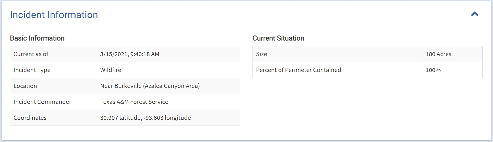
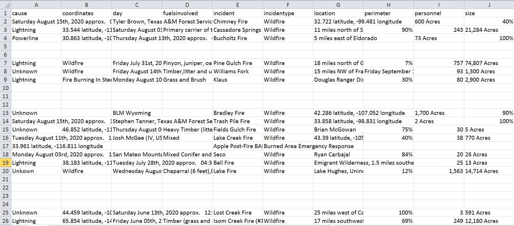
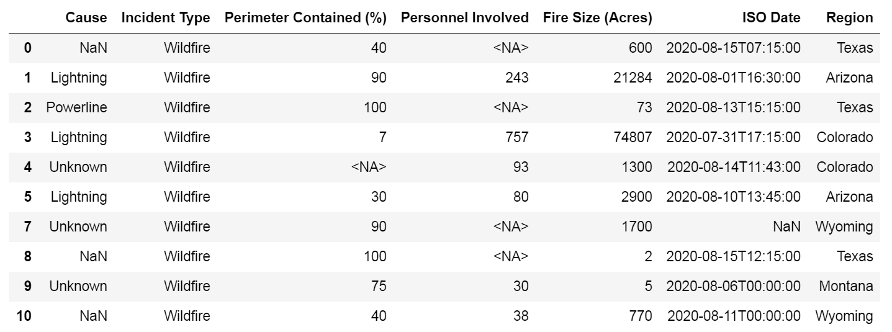

# Learn to Scrape and Analyze Data

## Analyzing Forest Fires

---


[](https://lgtm.com/projects/g/Ringdealer/forest-fires/context:python)

[](https://github.com/Ringdealer/forest-fires/issues)


`Marpesia eleuchea`, known commonly as `Antillean Daggerwing`, is found in the West Indies and sometimes in Florida keys. `Marpesia eleuchea eleuchea` is an endemic Cuban subespecies. Sometimes is abundant in groves and similar localities throughout the island. It is frequently found on the edge of forests, perched on flowers at a certain height. The specimen shown in the photo is a female.
---


> Marpesia eleuchea eleuchea [Photo by Ringdealer]
---

## Table of Contents
- [Description](#description)
- [Technologies](#technologies)
- [Installation](#installation)
- [Sample Output](#sample-output)
- [API Reference](#api-reference)
- [Using Jupyter Notebook](#using-jupyter-notebook)
- [Roadmap](#roadmap)
- [Comments and Suggestions](#comments-and-suggestions)


---

### Description
This project uses a csv file scraped from InciWeb (http://inciweb.nwcg.gov), an interagency all-risk incident web information management system, with information about forest fires in the United States. The aim of this project is to show all the stages of the data analysis workflow. The steps to follow are:

- Scrape the data set
- Prepare and clean the data set
- Deal with missing values and data transformation
- Apply machine learning algorithms and data visualization tools

I considered after scraping the web site to start documenting the project with the second stage. Here I discuss how to prepare and manage the data set for wrongly inserted info and type conversion. The project illustrates different tools provided by Python to perform these tasks.

---

### Technologies
- Python
- Jupyter

---

### Installation
- pip install pandas
- pip install numpy
- pip install dateparser
- pip install reverse_geocoder

---

### Sample Output


> Inciweb website Table of Incidents section



> Inciweb website Incident Information section



> Data scraped and saved as csv file



> Data frame after cleaning and manipulation (missing values not handled)
---

### API Reference
```python
def convert_to_int(mod_df, col):
    i = 0
    for word in mod_df[col]:
        if isinstance(word, str):
            word = word.rstrip()
            word = word.replace(',', '')
            if word.isdigit():
                mod_df.at[i, col] = int(word)
                i += 1
            else:
                i += 1
        else:
            i += 1
    return mod_df
```
---
### Using Jupyter Notebook

The csv file is in folder `blazes`, to read it into a data frame run the command:

`df = pd.read_csv('blazes/fires.csv')`

 The functions written to deal with the data are in module `mender_tools.py`. To import the module in a Jupyter notebook:

 `import mender_tools as mt`

---
### Roadmap
The project is 4 chapters long not including the  introduction and appendix: 

- Chapter 1: Scraping the Web Site
- Chapter 2: Preparing the Data
- Chapter 3: Dealing with Missing Values 
- Chapter 4: Analysis of the Data


Currently chapter 2 is finished. I pretend to follow with chapter 3 and chapter 4, leaving chapter 1 last. The whole project will be documented in a single pdf file.

---
### Comments and Suggestions

After saving the dataframe as a csv file and then read it again into a new dataframe I notice that the column `Personnel Involved`, wich `float` values were converted to `int` via `astype(Int64)`, was converted back to `float`. I took care of this running again `astype(64)`. It is possible this is happening because Python's built-in csv module is very unsophisticated at handling mixed data types and does this type of conversion at import time.

In the creation of the `Region` column the function `create_region_col`, which uses the package `reverse_geocode` via the function `get_location`, took more than a minute to execute. Any suggestion will be appreciated.

---


## References

[Back to the Top](#Learn-to-Scrape-and-Analyze-Data)


